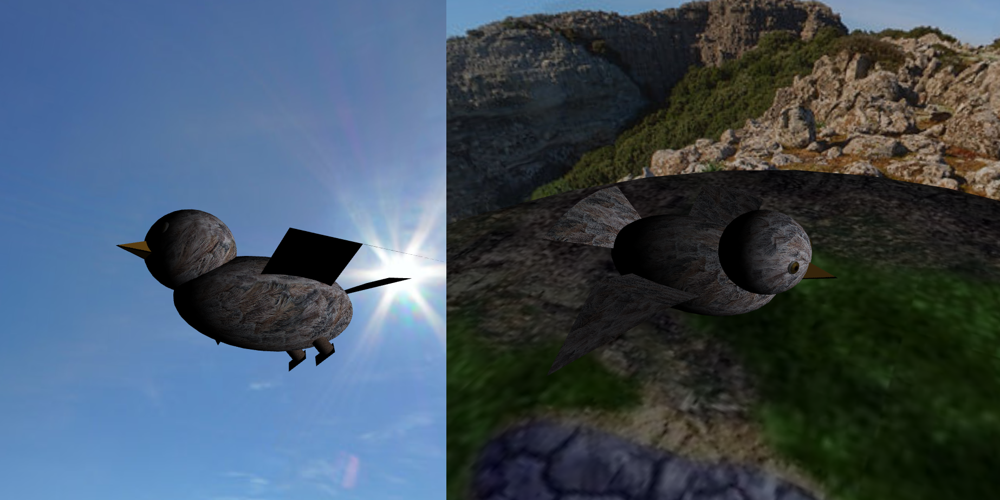
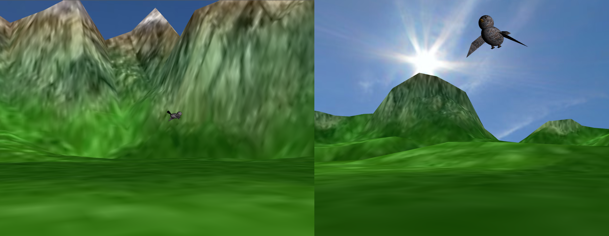
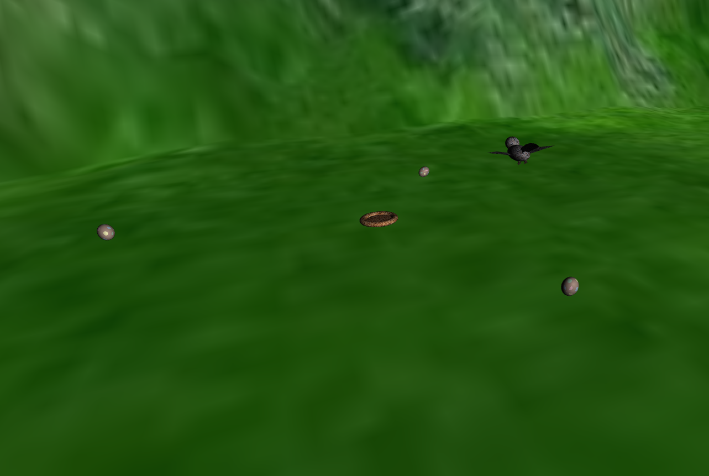
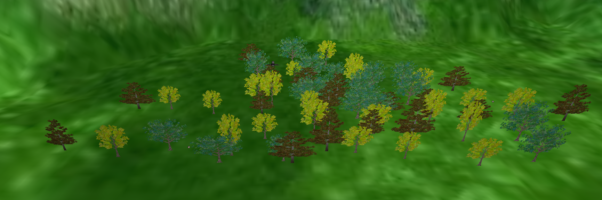

# CG 2022/2023

## Group T03G06

## Project

### Point 1 - Sphere
- Initially we were having a little bit of trouble to draw the sphere, but then we realised that to draw it we would need a implementaion similar to the used to draw the cylinder. So, we reused that code and made some modifications and it was pretty inutitve doing like that.
- To apply the texture we found it very easy and was similar to what we did in TP classes.

### Point 2 - Panorama
- To invert the faces of the sphere, all that's needed is to reverse the order in which the vertices are passed to the `indices` array, and invert the sign of each component of the normals.
- For centering the sphere to the camera, a translation is performed to the position of the camera's center (given by the `camera.position` member) inside *MyPanorama*'s `display` method, by passing the aforementioned member as an argument.

### Point 3 - Bird
#### Subpoint 1 - Model
- The bird class *MyBird* contains several body parts which are classes themselves too (*BirdWing*, *BirdHead*, etc.). This allows for better flexiblity when it comes to customizing and later animating the bird, as each body section is its own entity.
- To model the bird, objects created from previous tasks were used, such as cones, cylinders, pyramids, etc. These objects were transformed using the transformation functions learnt during classes (scaling, rotation, translation) in order to shape and position them and make up the bird. The object classes were modified to better suit the project, such as to construct the **texCoords** array to enable the use of textures on the them.
- There's a unique material for every texture applied to the bird. The eyes have a high specular component and low diffuse component, the feathers, beak and the skin for the legs and feet have a high diffuse component and some specular component.

#### Subpoint 2 - Animations
- The height and wing flapping animation are synced due to sharing the same base time period. This being equivalent to 1 second, achieved by having a factor of $2\pi$ inside the $\sin$ function used to update the animation control variables (`dy` and `dWingAngle`).
- To update the animation control variables, time was converted into seconds. Furthermore, for these animations, the timestamp of each frame is used.
- A sinusoidal function is described as $A\times\sin(\omega t + \phi)$. The relevant term here is $\omega$, which defines the rate of change of the function. The higher it is, the faster the rate of change, the lower the period becomes, and vice-versa. For the second animation, the bird's speed is used as the rate of change, $\omega$, thus as the bird speeds up, so will the flapping of the wings. 

#### Subpoint 3 - Control
- As suggested, the bird keeps track of its orientation as the angle around the YY axis. This allows to determine the **x** and **z** components by thinking of the bird's direction as a vector around a unit circle centered at the YY axis, and using either the $\sin$ or $\cos$ functions, and the angle of that vector being given by the bird's orientation.
- To get the displacement, the motion formula is used where $x = x_0 + v_x\times\delta t$. To attain $v_x$, the bird's speed is multiplied by the **x** component of the bird's direction, $sin(orientationAngle)$. $\delta t$ is the time between the last frame and the current frame, converted into seconds.
- The bird is free to rotate in 360 degrees, and the speed is capped so that the bird doesn't accelerate forever.
- The *speedFactor* is used similarly as the bird's speed in the wing flapping animation, working as another multiplicative factor to influence the rate of change of the sinusoidal function.

### Point 4 - Terrain
- The shaders used to create the terrain were based on the shaders used in [tp5](../tp5/README.md) to create the wave effect on water. They differ in the inclusion of a third texture for the shaders of this project, the altimetry to change the color of the terrain based on its height.
- In order to align the coordinates of the terrain with its color on the altimetry texture, the blue color component of the corresponding heightmap texture coordinates was inverted (because the altimetry goes from bottom to the top, however the starting point of the texture coordinates is at the top).
- To get the flat area on both the terrain and on the heightmap, both their images were edited using the website [pixlr.com](https://pixlr.com/x/).

### Point 5 - Eggs and Nest
#### Subpoint 1 - Object Creation
- The nest is created using a torus (from *MyTorus* class) and a flat, one-sided circle (from *MyCircle* class). The texture coordinates for the nest's circular base were adjusted so that the square texture could be correctly drawn on the circle's surface.
- The number of eggs in the scene is adjustable. Their positions, as well as the nest's, are randomly generated within the flat area of the terrain. For the eggs, their rotation is also randomly generated. The positions of the eggs and nest avoid overlapping by use of a mininum distance between them.
- In theory, both the eggs and the nest are drawn right on top of the flat terrain surface ($y=-60$), however, in the case of the eggs, they may clip slightly into the terrain due to their random rotations.

#### Subpoint 2 - Catching and Dropping Eggs
- The bird may attempt to grab an egg at any time, but is only able to drop the egg if in the vicinity of the nest, after which the egg is dropped from the bird's feet in a parabolic arc ([Section 7]()) towards the base of the nest.

### Point 5 - Eggs and Nest
#### Subpoint 1 - Object Creation
- The nest is created using a torus (from *MyTorus* class) and a flat, one-sided circle (from *MyCircle* class). The texture coordinates for the nest's circular base were adjusted so that the square texture could be correctly drawn on the circle's surface.
- The number of eggs in the scene is adjustable. Their positions, as well as the nest's, are randomly generated within the flat area of the terrain. For the eggs, their rotation is also randomly generated. The positions of the eggs and nest avoid overlapping by use of a mininum distance between them.
- In theory, both the eggs and the nest are drawn right on top of the flat terrain surface ($y=-60$), however, in the case of the eggs, they may clip slightly into the terrain due to their random rotations.

#### Subpoint 2 - Catching and Dropping Eggs
- The bird may attempt to grab an egg at any time, but is only able to drop the egg if in the vicinity of the nest, after which the egg is dropped from the bird's feet in a parabolic arc ([Section 7]()) towards the base of the nest.

### Point 6 - Integration of Trees
#### Subpoint 1 - Billboard Creation
- The normals used to determine the orientation angle of a *MyBillboard* object in order to face the camera are obtained from: 
    1. One of the normals of the *MyQuad* object pertaining to the *MyBillboard* class. The normals of the quad are stored in a unidimensional array, so to get the relevant components ($x$ and $z$), the first and third index are accessed. Since the normals are all equal for the quad, it doesn't matter which one to take.
    2. The normal of the camera retrived via the `calculateDirection` method of the *CGFcamera* class.
- These vectors are represented as 2-dimensional vectors, as the only components to keep in mind are $x$ and $z$. The direction of the angle (clockwise or anti-clockwise) can be determined by getting last value of the cross product of these two vectors, whose result is a 3-dimensional vector. The value of the angle can be calculated from the dot product between the two vectors, which results in a single scalar value, that is then used as the argument of the inverse cosine function $acos$ to get a value in angle units (radians).
- Because the quad is drawn facing the positive $z$ axis and the camera sits in the negative axis, an additional rotation of 180 degrees is necessary so that the quad faces towards the camera (otherwise it would still rotate according to the camera's direction, but it would be facing away from the camera).
- The *MyBillboard* class doesn't hold any information about its position on the scene, since the coordinates indicating where it should be drawn are passed into the `display` method.

#### Subpoint 2 - Grove of Trees
- The amount of tree groves that appear in the scene can be customized, as well as the mininum distance between one another.
- The groves are drawn with randomly generated positions that fit inside the flat area of the terrain, but the range of positions is different between groves. This is due to one of the grove types (*MyTreeRowPatch*) only having trees along the $x$ axis, whereas the other grove type (*MyTreeGroupPatch*) has trees spanning both $x$ and $z$ axis.
- Because the individual trees (which are *MyBillboard* objects) don't hold information regarding their position, the grove classes need a way to define the position of each trees belonging to the grove based on the position of the grove as a whole itself. The position stored in each grove class corresponds to the coordinates of the middle point of the grove, and each tree of the grove is drawn in relation to that middle point.
- The relative positions for each tree in the groves is defined as an array of relative base positions (eg: For the *MyTreeRowPatch* this array is defined as `[[-2, 0], [-1, 0], ..., [3, 0]]`). This allows to position each individual tree based on the coordinates of the grove. These base positions then suffer a random displacement, are scaled to space out the trees from each other, and then they're passed as the coordinates inside the `display` method for the respective tree in the grove.

## Screenshots
|  |
|:--:|
| *Fig. 1 - Panorama view.* |

|  |
|:--:|
| *Fig. 2 - Two view angles of the bird model.* |

|  |
|:--:|
| *Fig. 3 - Two view angles of the scene containing the bird, terrain and background.* |

|  |
|:--:|
| *Fig. 4 - View of the terrain with the eggs and nest.* |

|  |
|:--:|
| *Fig. 5 - View of the flat area with tree groves drawn within.* |
