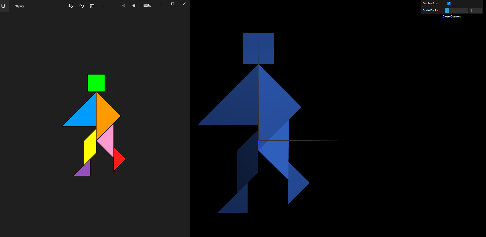

# CG 2022/2023

## Group T03G06

## TP 2 Notes

### Exercise 1
- The tangram part exercise turned out to be relatively straightforward after figuring out how to properly make use of the transformation functions.
- Keeping in mind that transformations must be written in reverse order can be difficult, but there's an easy work around: write the first transformation and then write each following transformation in the line directly above the previous.
- Checking the "CFG.js" file in the lib folder revealed that the class *CFGobject* keeps a reference to the scene it's created in, which facilitated the implementation of the *MyTangram* class.

### Exercise 2
- The part of doing the cube was pretty simple because it was just working with vertices and indexes like we did in the first class
- After that connecting the cube to the tangram figure in our case was easy and we just needed a translation
- To rotate all the tangram figure with the cube as base, we did a rotation and a translation with the tangram figure as only one figure to put it in the right place. 

### Exercise 3
- TODO

