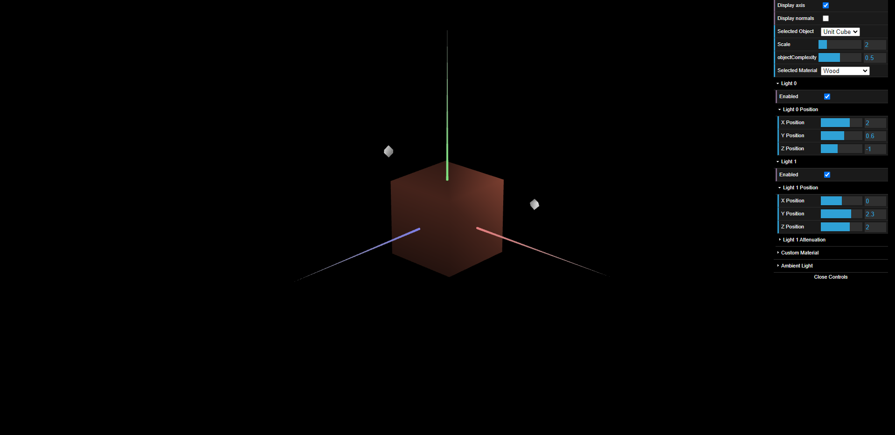
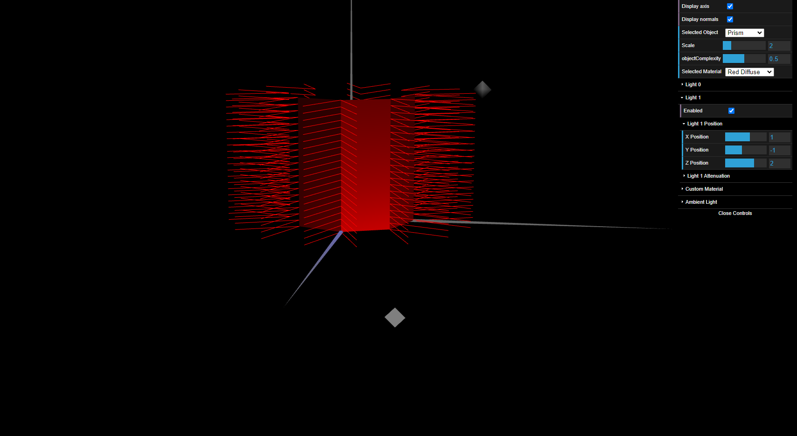

## TP 3 Notes

### Exercise
- The normals for the unit cube were made by hand, but it could be improved by making use of an algorithm/function instead.
- Before declaring the proper normals for the tangram, it was only possible to make out
a few pieces at a time with the light shining on it. To see the other pieces, the light had to be moved significantly. However after setting the right normals, the whole tangram became visible.
- The tangram, being a composition of objects, lacked vertices and normals. So when trying to view the normals of the tangram, it would disappear because it didn't have any: the objects that composed it did. So to display the normals, the *MyTangram* class has to defer the calls to each individual object that composes it.
- When applying color to a material, if only specular light is defined the results won't turn out as expected. For example for the pink triangle of the tangram, defining the pink color as the specular light will yield a yellow-ish color instead when light shines on it. A solution was to set the pink color as diffuse lighting, and then apply a uniform high specular light value for each of the RGB components. Even with this solution, if the light is too close to the piece, its color will change, likely due to the high specular component.
- Part 2, 7. \- According to this definition for the normals of each of the prism's faces, only one point is used for the calculation of the normal for the entire face, in the same way that constant shading utilizes the normal of a single point to determine shading for the whole face.

## Screenshots
|  |
|:--:|
| *Fig. 1 - Unit cube with the wood material applied.* |

|  |
|:--:|
| *Fig. 2 - Tangram figure with respective colors and diamond with custom material.* |

|  |
|:--:|
| *Fig. 3 - 20 stack prism with its respective normals displayed.* |