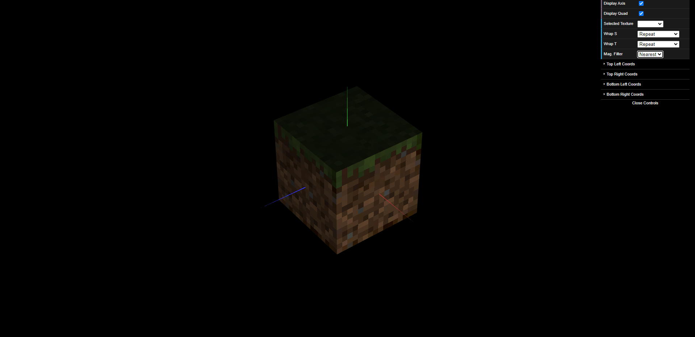

## TP 4 Notes

### Exercise
- Some of the objects that compose the tangram are of the same class, such as *MyTriangleBig* and *MyTriangleSmall*, so to differentiate them a new argument is passed to the class constructor, **color**. This allows for the distinction between the colors in order to make the correct texel mapping.
- Initially the *MyUnitCubeQuad* cube displayed the textures in a really dark tone. This was due to using the default material created in *MyScene.js*, which had a low ambient and diffuse light components. To make it brighter, a new material was created inside *MyUnitCubeQuad.js* class with a high ambient and diffuse light components.

## Screenshots
|  |
|:--:|
| *Fig. 1 - Tangram with all textures applied.* |

|  |
|:--:|
| *Fig. 2 - MyUnitCubeQuad with textures applied and **gl.NEAREST** filtering.* |
