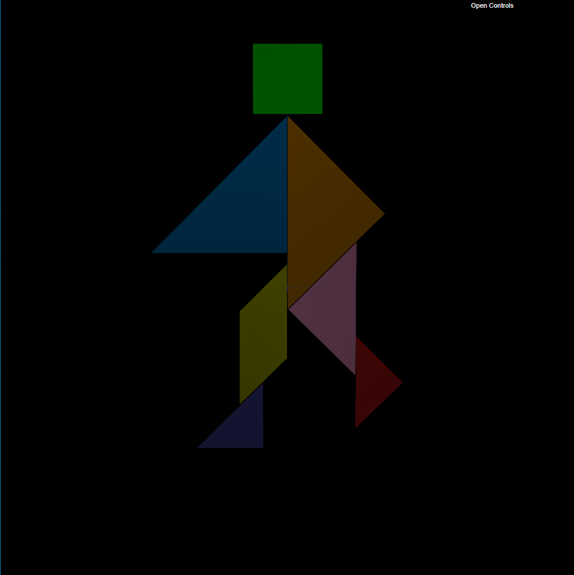

## TP 4 Notes

### Exercise
- Some of the objects that compose the tangram are of the same class, such as *MyTriangleBig* and *MyTriangleSmall*, so to differentiate them a new argument is passed to the class constructor, **color**. This allows for the distinction between the colors in order to make the correct texel mapping.

## Screenshots
|  |
|:--:|
| *Fig. 1 - Tangram with all textures applied.* |

